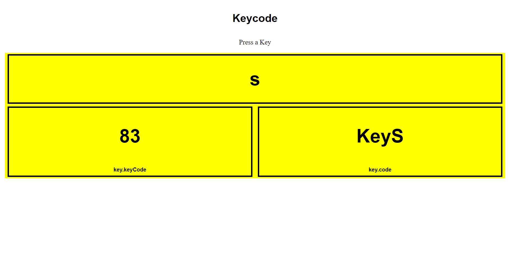

# Keycode Project

This project demonstrates how to capture key presses in a web browser and display their corresponding key codes and key names dynamically on the webpage.

## Table of Contents
- [Description](#description)
- [Usage](#usage)
- [Technologies Used](#technologies-used)
- [Screenshot](#screenshot)

## Description

The project consists of an HTML file (`index.html`), a CSS file (`style.css`), and a JavaScript file (`script.js`). When a key is pressed on the keyboard, the webpage dynamically updates to display the pressed key's name, key code, and JavaScript key code.

## Usage

Simply open [KeyCode](https://key-code-1.netlify.app/). Press any key on your keyboard, and the webpage will update to show the pressed key's information.

## Technologies Used

- HTML
- CSS
- JavaScript

## Screenshot

